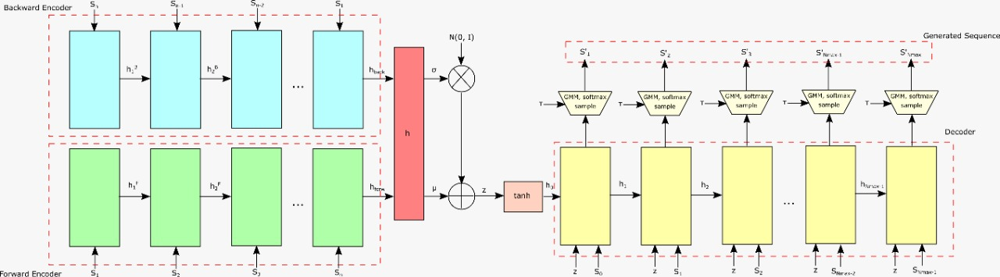

  
# Replication project: "A Neural Representation of Sketch Drawings"  
  
Jou-Hui Ho, Hojin Kang  
  
  


### Description of the problem  


The main problem to solve consists of the generation of new hand-drawn sketch drawings from training examples of <i>Quick, Draw!</i>, a sketching game. The solution will be implemented using an encoder-decoder autoregressive model.  
  
- <b>Input:</b> The input of the model is a dataset of hand-drawn sketches, each represented as a sequence of motor actions controlling a pen: the direction of the movement, when to lift the pen up, and when to stop drawing. More concretely, each input is a vector containing 5 elements: , where the first two elements are the offset distance from the previous point, and the last 3 elements represents a one-hot vector of the 3 mentioned states. The total input is the concatenation of the direct sequence of vectors and the inverse one.  
  
- <b>Output:</b> At each test, our autoregressive model outputs the 5 element vector’s probability distribution, and then we get samples of that distribution. Hence, out complete model should output a vector of the same structure than the given one at the input.  
  
  

### Metrics  


Most of the results obtained from the work are visual rather than specific metrics. The results are mainly reflected in the similar but distinct sketches generated from the autoregressive model. We expect to generate similar sketches to the training data as the paper shows.  
  
A metric that could be used to measure the network's performance is its loss value. However, these values could widely vary depending on the dataset that is being used and the parameters of the network. It also depends on the training (and the number of training samples used). Hence, we cannot specify an expected value of loss, since it would be more of a wild guess rather than an expected value.  

We propose another metric that could be used to measure the performance of the system. Since what we want is to generate similar sketches to those made by humans, we make a grading system in which each sketch (either real or generated by the algorithm) is graded as real, possibly real or fake. From this grading system we expect the real sketches to be mainly classified as real, whilst most of the ones generated by the algorithm should be classified as either real or possibly real. The expected result is that at least more than half of the sketches generated by the algorithm are classified as real or possibly real, on average.
  
  

### Training data  

The training data is obtained from the  <i>Quick, Draw!</i> dataset, given at https://github.com/googlecreativelab/quickdraw-dataset. It contains 50 million drawings across 345 categories, each captured as timestamped vectors, tagged with the concept that the sketch is representing. Each class is a dataset of 70K training samples, in addition to 2.5K validation and 2.5K test samples. As an initial approach of the project’s aim, we will take 10 categories of the complete dataset.  
  
Ha & Eck’s previous work includes a simplification of the dataset, scaling each data into a 256x256 region, resampling all strokes with a 1 pixel spacing. Each drawing array corresponds to an array of strokes, and each stroke consists of a sequence of vectors of five elements, as we previously described.   
  
  

### Initial architecture  

We will implement a Sequence-to-Sequence Variational Autoencoder (VAE), consisting of two neural networks: an encoder and a decoder. Our encoder is a bidirectional RNN that receives the concatenation of both direct and inverse sequences of the sketch strokes, and passes it through a fully connected layer, resulting 2 parameters  and , each of size .   


Then, using these parameters, along with , we construct a distribution for a latent vector of size , given by . It is important to note that the outputs of the encoder are the parameters of the gaussian distribution (  and ), and the next step consists in sampling from that distribution, obtaining a vector of size .   
  
Under this encoding scheme, the latent vector z is not deterministic but a random vector condition the input sketch.  
  
The decoder is an autoregressive RNN that takes that latent vector  and samples output sketches. At each step i, the decoder is fed with the previous point  and the latent vector  as a concatenated input . The position of each stroke is modeled as a Gaussian Mixture Model, with  normal distributions, and  as a categorical distribution to model .   
  
, where .
  
The output of the decoder is the concatenation of  parameters:  of each   parameters of the  distributions,  parameters due to the mixture weights of each distribution, and the 3 logits needed to generate .   
  

  
Finally, we apply softmax to each type of parameters, and sample a 5 element vector from the output distribution. This final vector is the actual stroke element  for that time step, and it’s used as input for the next time step. And so on, until it returns , or when it has reached the maximum number of samples.

The following image shows the architecture of the VAE.



The following equations characterize the backward enconder of the architecture.


We also have the equations that characterize the forward encoder of the architecture.


Once  and  are calculated, is the vector resulting from both vectors being concatenated.


From the previous value we obtain (http://latex.codecogs.com/gif.latex?%5Csigma)) and (http://latex.codecogs.com/gif.latex?%5Cmu)), with the following equations.


 Once the value of  is determined, the values for the decoder are given by the following equations.


Then we calculate the value for  as.


The values for  correspond to the values for the  Gaussian Mixture Models (GMM) for the next data point, and the type of stroke (lifted pen, pen on paper, or end of sketch). This means that:


With this values, the actual values for the distributions are calculated as follows.


From the previous expressions, the values for the next stroke can be sampled.


### Github repository: 
https://github.com/hojink1996/proyecto_deep_learning/


```python

```


```python

```
